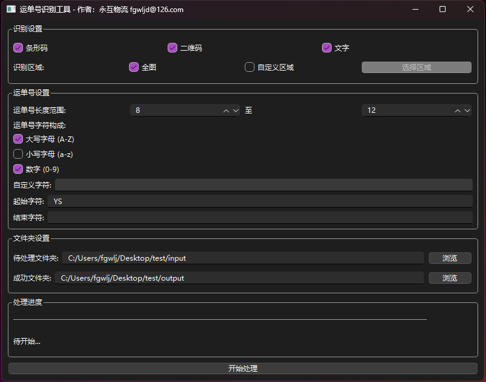
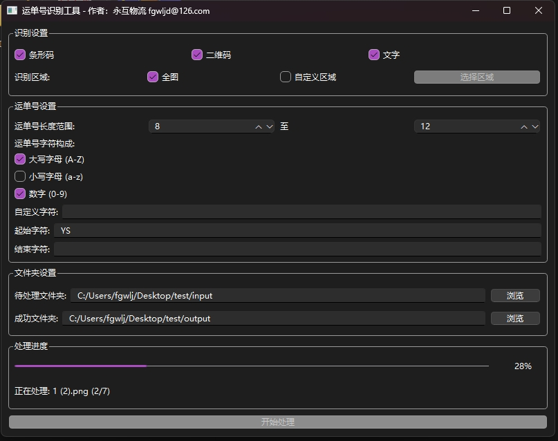
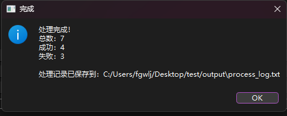
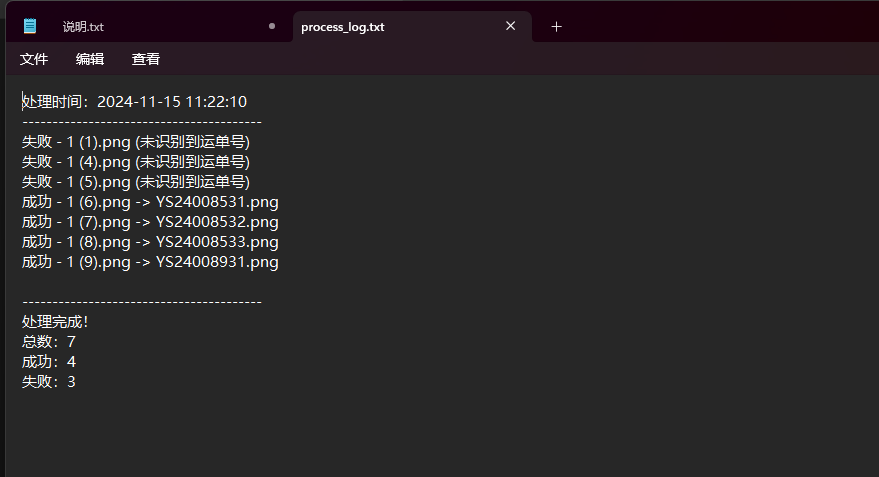
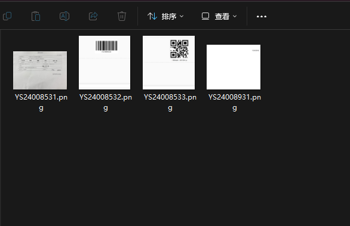
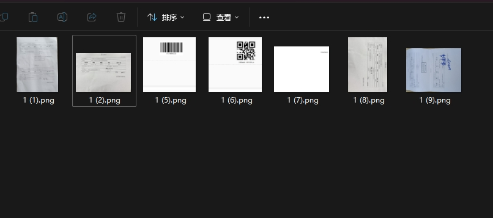

# 运单号智能识别与重命名工具

<em>运单号智能识别与重命名工具主界面</em>

## 🚀 项目概述

随着物流行业的快速发展，传统的手工管理回单的方式已经难以满足日益增长的需求。面对大量的电子版回单（通常为PDF或JPEG格式），人工逐个检查并重命名不仅耗时且容易出错。为此，我们设计了一款运单号智能识别与重命名工具，旨在简化这一流程，提升工作效率。

## 🔍 主要功能

### 1. 强大的识别能力

<em>支持多种识别方式，适应不同场景</em>

### 2. 高度定制化的运单号设置

<em>灵活的运单号规则配置</em>

### 3. 便捷的文件管理

<table>
  <tr>
    <td></td>
    <td></td>
  </tr>
  <tr>
    <td align="center"><em>输入文件管理</em></td>
    <td align="center"><em>输出文件管理</em></td>
  </tr>
</table>

## 💻 软件使用方法

### 1. 启动软件

<em>软件启动界面</em>

### 2. 配置识别参数

<em>识别参数配置界面</em>

### 3. 设置文件路径

<em>文件路径配置界面</em>

### 4. 开始处理

<table>
  <tr>
    <td></td>
    <td></td>
  </tr>
  <tr>
    <td align="center"><em>批量处理进行中</em></td>
    <td align="center"><em>处理完成界面</em></td>
  </tr>
</table>

### 5. 查看处理结果

<em>处理结果统计界面</em>

## 🔧 常见问题解决

### 识别准确率问题

<table>
  <tr>
    <td></td>
    <td></td>
  </tr>
  <tr>

  </tr>
</table>

Copyright © 2024 运单号智能识别工具团队. All rights reserved.

